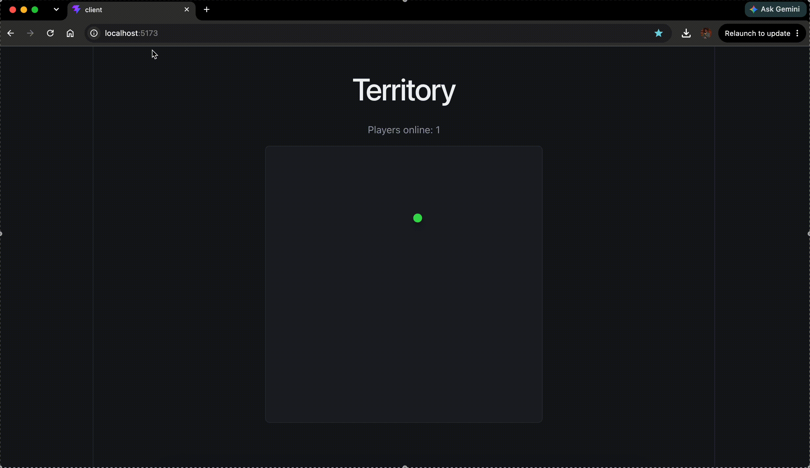

# Territory

A small real-time multiplayer prototype: a Go WebSocket server tracks
connected players and broadcasts joins/disconnects to everyone else, and a
React client renders each player as a colored dot on screen.



## Structure

- `server/` — Go WebSocket server (`gorilla/websocket`)
- `client/` — React + TypeScript client (Vite, TanStack Query)

## Running

**Server** (listens on `:8080`):

```bash
cd server
go run server.go
```

**Client** (dev server on `:5173`):

```bash
cd client
npm install
npm run dev
```

Open the client in two browser tabs to see players join/leave live.
